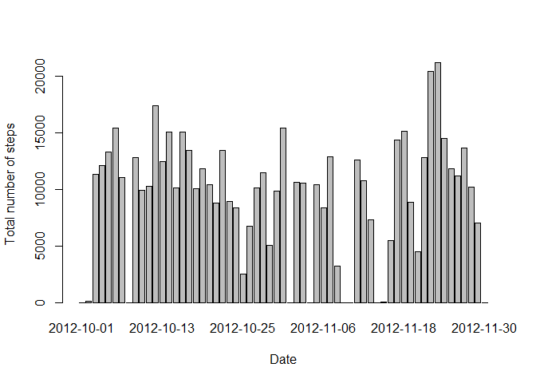
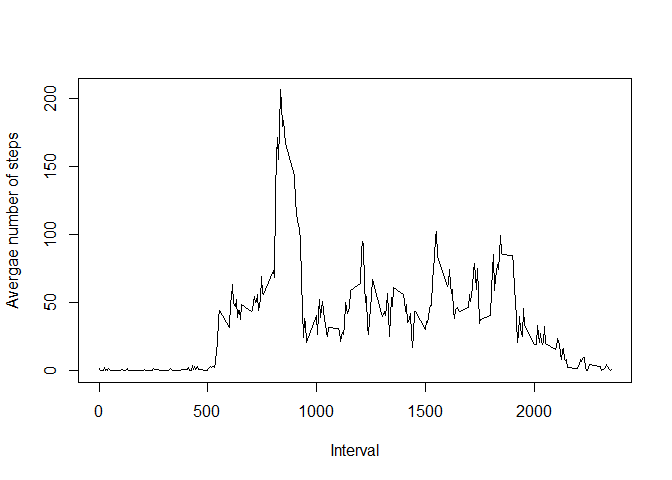
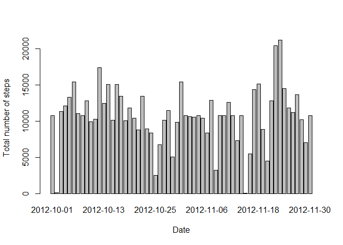
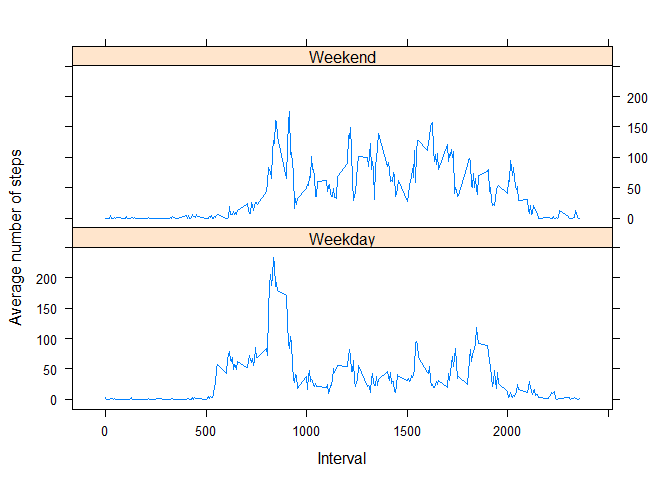

## Loading and preprocessing the data


```r
#Unzip the raw data, read it in object and process the variables in right format

unzip("activity.zip")
data <- read.csv("activity.csv")
data$date <- as.Date(as.character(data$date), "%Y-%m-%d")
str(data)
```

```
## 'data.frame':	17568 obs. of  3 variables:
##  $ steps   : int  NA NA NA NA NA NA NA NA NA NA ...
##  $ date    : Date, format: "2012-10-01" "2012-10-01" ...
##  $ interval: int  0 5 10 15 20 25 30 35 40 45 ...
```
## What is mean total number of steps taken per day?


```r
#compute total steps per day; plot the values per day; compute the mean and
#median of "total steps per day" computer earlier

stepsperday <- tapply(data$steps, data$date, sum, na.rm = TRUE)
barplot(stepsperday, xlab = "Date", ylab = "Total number of steps")
```

<!-- -->

```r
meanstepsperday <- mean(stepsperday, na.rm = TRUE) 
medianstepsperday <- median(stepsperday, na.rm = TRUE)
```

####Mean and median of number of steps per day are **9354.2295082** and **10395** respectively


## What is the average daily activity pattern?


```r
avgstepsinterval <- tapply(data$steps, data$interval, mean, na.rm = TRUE)
plot(names(avgstepsinterval), avgstepsinterval, xlab = "Interval", ylab = "
     Avergae number of steps", type = "l")
```

<!-- -->

```r
#finding the index in tht output which has the max value and finding the
#interval that corresponds to that index

maxstepindex <- which(avgstepsinterval == max(avgstepsinterval))
maxstepinterval <- names(avgstepsinterval[maxstepindex])
```

####On average across all days in the dataset, interval **835** contains the maximum number of steps  

## Imputing missing values


```r
#Compute the indexes of missing values and total number of missing values

missingindex <- which(is.na(data$steps))
totalmissingvalues <- sum(is.na(data$steps))
```

####Total number of missing values in data are **2304**


```r
# Strategy to set NA values. Value will be set to mean of the corresponding 
#5 minute interval. We'll be using dplyr package functions

library(dplyr)
```

```
## 
## Attaching package: 'dplyr'
```

```
## The following objects are masked from 'package:stats':
## 
##     filter, lag
```

```
## The following objects are masked from 'package:base':
## 
##     intersect, setdiff, setequal, union
```

```r
intervalmeans <- data %>% group_by(interval) %>% summarise(mean(steps, 
                                                                na.rm = TRUE))
names(intervalmeans) <- c("interval", "meanval")

#We'll create a new dataset with column on interval mean

data1 <- inner_join(data, intervalmeans, by = "interval")

#We'll use missingindex value computed earier to identify location of missing
#values in the data and will copy meaninterval values to those index

data1$steps[missingindex] <- data1$meanval[missingindex]

#With the new data set computing the total number of steps per day
# the new dataset does not have missing values anymore

totalsteps <- tapply(data1$steps, data1$date, sum)
barplot(totalsteps, xlab = "Date", ylab = "Total number of steps")
```

<!-- -->

```r
#computing new mean and median from the on total steps computed on new data set

meansteps <- mean(totalsteps)
mediansteps <- median(totalsteps)
```

####Mean and median of total number of steps per day are 1.0766189\times 10^{4} and 1.0766189\times 10^{4} respectively. Substituting missing values has changed the data


## Are there differences in activity patterns between weekdays and weekends?


```r
# For this analysis I will be using the initial data i.e. data with missing
# values. Copy the data to a new data frame and add a new column on type of day
# - weekday or weekend

data2 <- data
data2$typeofday <- as.factor(ifelse(weekdays(data2$date) == "Saturday" |
                                     weekdays(data2$date) == "Sunday", "Weekend",
                                     "Weekday"))
#use the dplyr package loaded earlier to compute, interval and type of day 
#wise average number of steps
meanstepsinttypeday <- data2 %>% group_by(interval, typeofday) %>% summarise(
                        mean(steps, na.rm = TRUE))
names(meanstepsinttypeday) <- c("interval", "typeofday", "meansteps")

#We'll use lattice package to draw the panel plot of interval wise avg number
#of steps. It will have multiple panels dependent on type of day

library(lattice)
xyplot(meansteps ~ interval | typeofday, data = meanstepsinttypeday, type = "l"
       , xlab = "Interval", ylab = "Average number of steps", layout = c(1,2))
```

<!-- -->

####As we can see from the plot there is difference in activity between weekdays and weekends. 
